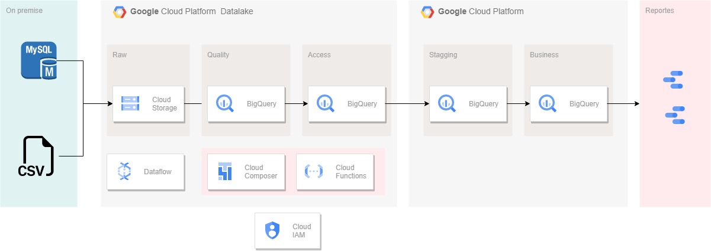
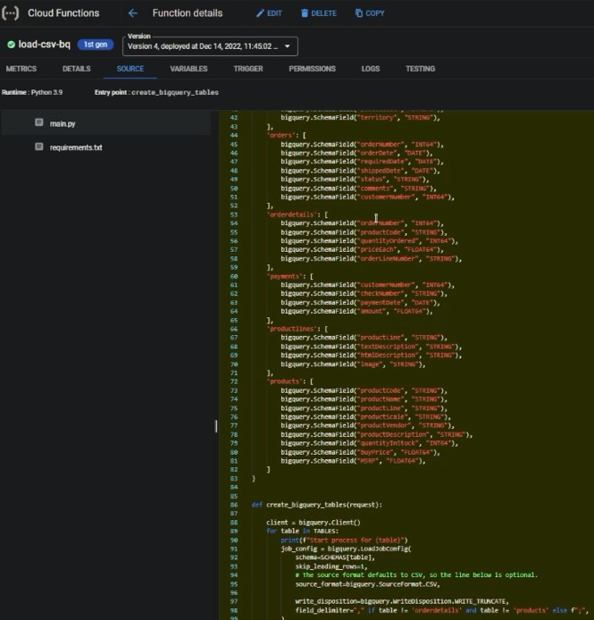
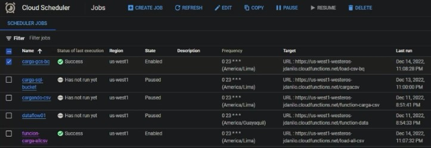
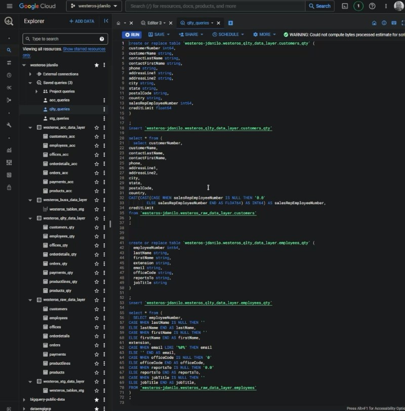
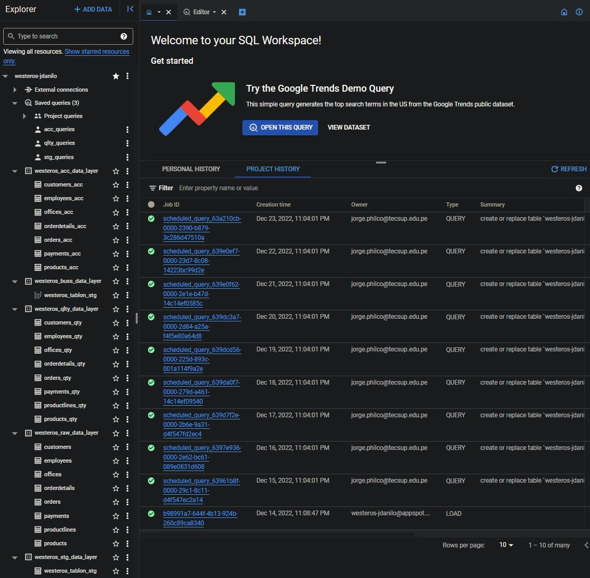
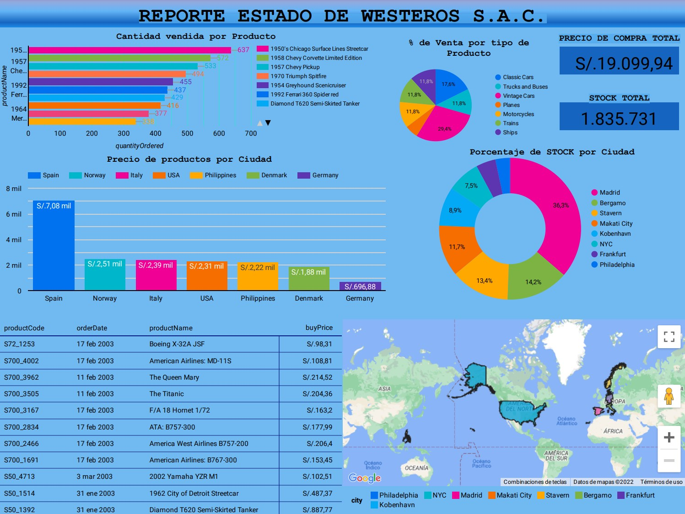

# Westeros-ETL-GCP-PROJECT

Projecto en GCP de ETL desde MYSQL to Bigquery
Westeros es una empresa ficticia con datos en una base de datos MySQL y un archivo CSV almacenado en una instancia de Compute Engine. Se esta realizando un proceso ETL para conectarse a la Base de datos MYSQL hacer un query y extraer las tablas y guardarlas en formato .csv en la nube en Cloud Storage en la capa RAW. Seguidamente estos archivos .csv seran llevado a BigQuery para hacer el analisis, procesamiento y limpieza por capas. Finalmente se realiza la conexion a Looker Studio para generar un dashboard e identificar las insights claves.

# Arquitectura realizada

Empleando una arquitectura en Google Cloud Platform
Se ha usado el servicio de Cloud Functions, el cual es un servicio serverless para crear las 2 funciones que permitan traer en formato .csv los archivos de la base de datos y la otra funcion para llevar estos archivos hacia BigQuery en la capa RAW.

 

Junto con Cloud Scheduler, se permite automatizar la ejecucion de las funciones en Cloud functions todos los dias a las 23:00 horas y generando menos gastos y facturará por el tiempo de ejecución de la función.

Se ha usado el servicio Cloud Storage para almacenar los archivos .csv como un Datalake.

Se ha usado el servicio de BigQuery para hacer el procesamiento, limpieza y desnormalizacion de las tablas por capas
La ingesta se debe hacer todos los días a las 23:00 
1)Consumir ambos orígenes y colocarlos en la capa raw
2)Transferirlos a cada capa Raw, Quality Access
3)En la capa stagging se debe desnormalizar las tablas para construir un tablon
4)En la capa business se debe construir vistas que tendrán lógicas de negocios para extraer información de valor
5)Construir tableros que consuman las vistas y devuelvan gráficos de interés

Se ha realizado la creacion de JOBS para realizar consultas programadas todos los dias a las 23:00 horas y de se pueda automatizar el procesamiento por capas en BigQuery

Finalmente se ha creado un dashobard usando Looker Studio para generar información sobre las ventas de Westeros. https://datastudio.google.com/s/r2sN0TkEY9w

